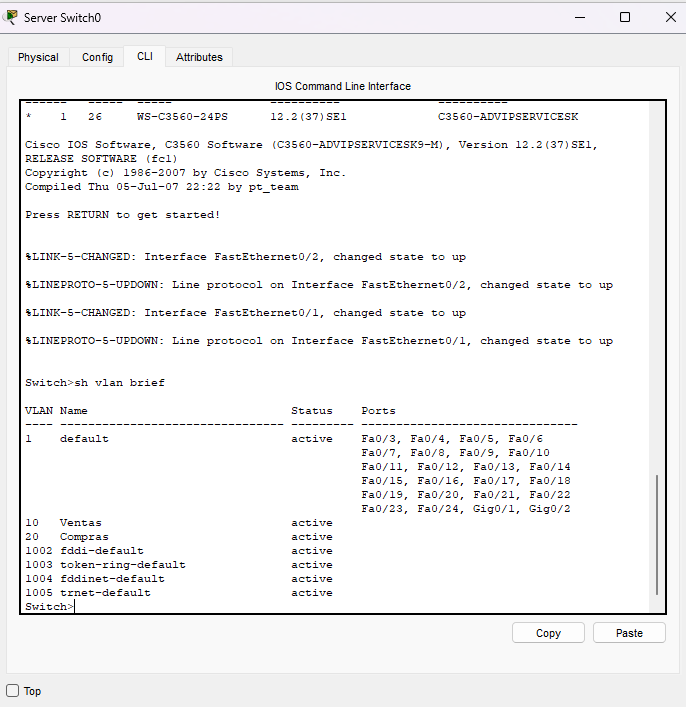
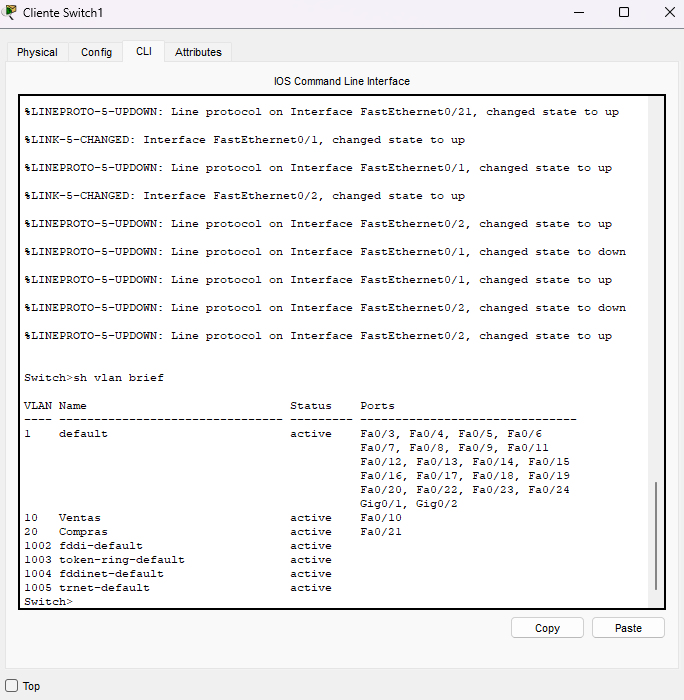
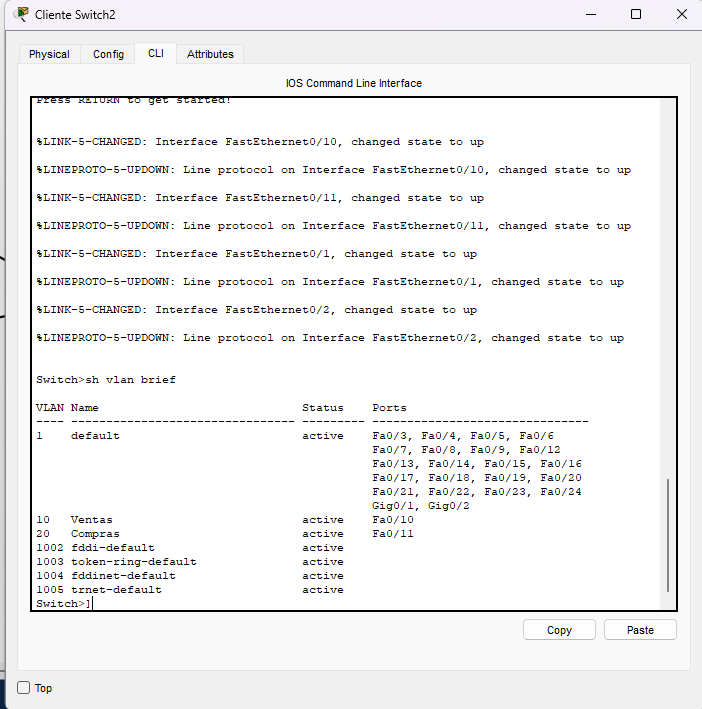
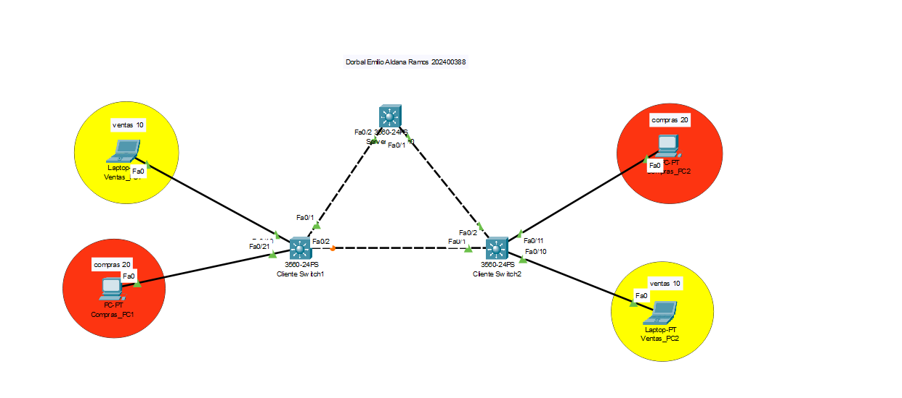
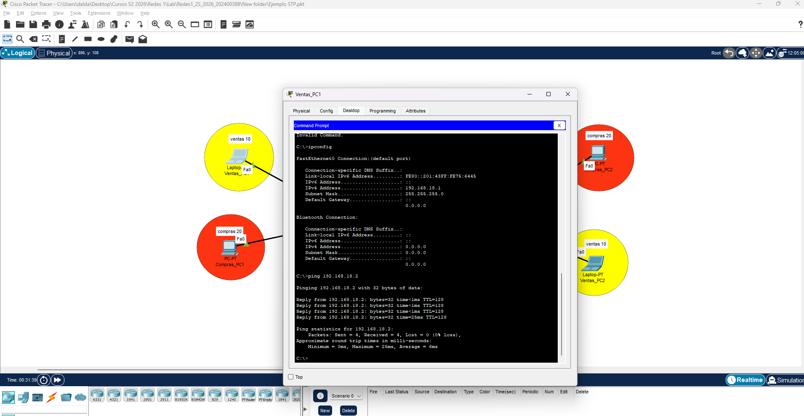

# Análisis del protocolo Spanning Tree (STP), PVST y Rapid PVST

## 1. Introducción

En redes Ethernet conmutadas es común implementar enlaces redundantes con el objetivo de mantener la disponibilidad de la comunicación ante la falla de un enlace. Sin embargo, cuando existen varios caminos de Capa 2 entre los mismos switches, pueden generarse bucles de conmutación.

El protocolo **Spanning Tree Protocol (STP)** fue diseñado para evitar estos bucles mediante la creación de una topología lógica libre de ciclos. Para lograrlo, STP selecciona un switch raíz, determina los mejores caminos hacia dicho equipo y coloca algunos puertos redundantes en estado de bloqueo.

La práctica desarrollada utiliza tres switches Cisco conectados de forma redundante y dos VLAN de usuarios. El análisis contempla el funcionamiento de STP tradicional mediante **PVST** y posteriormente la comparación con **Rapid PVST**, evaluando principalmente el comportamiento de la red y el tiempo de convergencia cuando ocurre una falla.

---

## 2. Descripción de la red

La red está formada por tres switches Cisco 3560:

- **Switch0:** switch principal y seleccionado como Root Bridge.
- **Switch1:** switch de acceso.
- **Switch2:** switch de acceso.

Los tres switches poseen conexiones redundantes entre sí. Esta disposición permite disponer de rutas alternativas, pero también genera un posible bucle de Capa 2 si todos los enlaces permanecen simultáneamente en estado de reenvío.

Las VLAN utilizadas son:

| VLAN | Nombre | Función |
|---:|---|---|
| 10 | VENTAS | Equipos pertenecientes al área de ventas |
| 20 | COMPRAS | Equipos pertenecientes al área de compras |

Los enlaces entre switches se configuran en modo **trunk**, permitiendo el transporte de las VLAN 10 y 20.

Los equipos finales se conectan mediante puertos de acceso asignados a la VLAN correspondiente.

---

## 3. Direccionamiento IP utilizado

Para realizar las pruebas de conectividad se recomienda utilizar el siguiente direccionamiento:

### VLAN 10 - VENTAS

| Equipo | Dirección IP | Máscara |
|---|---|---|
| Equipo de Ventas conectado a Switch1 | 192.168.10.10 | 255.255.255.0 |
| Equipo de Ventas conectado a Switch2 | 192.168.10.20 | 255.255.255.0 |

### VLAN 20 - COMPRAS

| Equipo | Dirección IP | Máscara |
|---|---|---|
| Equipo de Compras conectado a Switch1 | 192.168.20.10 | 255.255.255.0 |
| Equipo de Compras conectado a Switch2 | 192.168.20.20 | 255.255.255.0 |

Al encontrarse los equipos de cada VLAN dentro de la misma red IP, no es necesaria la configuración de una puerta de enlace para las pruebas realizadas en esta práctica.

---

## 4. Problemas de una red redundante sin STP

La redundancia física proporciona tolerancia a fallos, pero en una red Ethernet de Capa 2 también puede ocasionar bucles.

Cuando una trama broadcast ingresa a una red con caminos redundantes y no existe STP, los switches pueden reenviarla por múltiples interfaces. La misma trama puede regresar posteriormente al punto de origen y continuar circulando de forma indefinida.

A diferencia de los paquetes IP, las tramas Ethernet no poseen un valor TTL que limite automáticamente la cantidad de saltos. Por este motivo, una trama puede permanecer circulando y multiplicándose dentro de la red.

Los principales problemas que pueden presentarse son los siguientes:

### 4.1 Tormentas de broadcast

Las tramas broadcast son reenviadas repetidamente por los switches. Esto incrementa de forma considerable el tráfico y puede llegar a consumir la capacidad disponible de los enlaces.

### 4.2 Duplicación de tramas

Una misma trama puede llegar al equipo destino varias veces debido a la existencia de distintos caminos activos.

### 4.3 Inestabilidad de la tabla MAC

Los switches pueden aprender una misma dirección MAC por diferentes interfaces en periodos muy cortos. Esto genera cambios constantes en la tabla MAC.

### 4.4 Saturación de la red

La repetición de tramas provoca un incremento constante del tráfico. Como consecuencia, la red puede volverse lenta o dejar de transportar correctamente el tráfico de los usuarios.

### 4.5 Pérdida de conectividad

Cuando la cantidad de tráfico generado por el bucle aumenta, las comunicaciones normales pueden comenzar a presentar pérdidas de paquetes o dejar de funcionar completamente.

---

## 5. Funcionamiento de Spanning Tree Protocol

STP evita los bucles creando una topología lógica libre de ciclos.

El protocolo realiza las siguientes funciones principales:

1. Elección de un **Root Bridge**.
2. Cálculo del mejor camino desde cada switch hacia el Root Bridge.
3. Selección de los puertos que deben reenviar tráfico.
4. Bloqueo lógico de los enlaces redundantes.
5. Activación de rutas alternativas cuando ocurre una falla.

Los enlaces bloqueados no son eliminados físicamente. Permanecen disponibles como rutas de respaldo y pueden ser utilizados cuando cambia la topología.

---

## 6. Elección del Root Bridge

La elección del Root Bridge se realiza utilizando el **Bridge ID (BID)**.

El Bridge ID está compuesto principalmente por:

- prioridad del switch;
- identificador asociado a la VLAN;
- dirección MAC.

El switch que posea el Bridge ID más bajo es seleccionado como Root Bridge.

Cuando todos los switches mantienen la prioridad predeterminada, la dirección MAC se utiliza como criterio de desempate. Para evitar que la elección dependa únicamente de la dirección MAC, en la práctica se configura manualmente a **Switch0 como Root Bridge**.

Configuración recomendada:

```cisco
enable
configure terminal
spanning-tree vlan 10,20 priority 4096
end
```

También puede utilizarse:

```cisco
spanning-tree vlan 10,20 root primary
```

Debe utilizarse uno de los dos métodos.

---

## 7. Roles de los puertos STP

### Root Port

Es el puerto de un switch no raíz que representa el mejor camino hacia el Root Bridge.

### Designated Port

Es el puerto encargado de reenviar tráfico hacia un segmento determinado.

En el Root Bridge, los puertos que forman parte de la topología normalmente funcionan como Designated Ports.

### Alternate Port

Representa un camino alternativo hacia el Root Bridge.

Mientras el camino principal se encuentra disponible, este puerto permanece bloqueado para evitar la formación de bucles.

---

## 8. Estados de los puertos

En STP tradicional pueden observarse los siguientes estados:

- Blocking
- Listening
- Learning
- Forwarding
- Disabled

Un puerto en estado **Blocking** no reenvía tráfico normal, pero continúa participando en el proceso de STP.

En Rapid STP los estados se simplifican principalmente a:

- Discarding
- Learning
- Forwarding

---

# 9. Configuración de las VLAN

## Switch0

```cisco
enable
configure terminal

vlan 10
 name VENTAS
exit

vlan 20
 name COMPRAS
exit

end
```

## Switch1

```cisco
enable
configure terminal

vlan 10
 name VENTAS
exit

vlan 20
 name COMPRAS
exit

end
```

## Switch2

```cisco
enable
configure terminal

vlan 10
 name VENTAS
exit

vlan 20
 name COMPRAS
exit

end
```

Si las VLAN ya fueron distribuidas mediante VTP, únicamente se requiere comprobar su existencia.

```cisco
show vlan brief
```

### Evidencia de configuración de VLAN

Las siguientes capturas muestran la información obtenida mediante `show vlan brief` en cada uno de los switches de la red. Con estas salidas se verifica la existencia de las VLAN utilizadas en la práctica y su disponibilidad en los equipos correspondientes.

**Switch0**



*Figura 1. Verificación de las VLAN configuradas en Switch0.*

**Switch1**



*Figura 2. Verificación de las VLAN configuradas en Switch1.*

**Switch2**



*Figura 3. Verificación de las VLAN configuradas en Switch2.*

---

# 10. Configuración de enlaces trunk

Los enlaces entre switches deben transportar las VLAN 10 y 20.

## Switch0

```cisco
enable
configure terminal

interface range fastEthernet 0/1-2
 switchport mode trunk
 switchport trunk allowed vlan 10,20
 no shutdown
exit

end
```

## Switch1

```cisco
enable
configure terminal

interface range fastEthernet 0/1-2
 switchport mode trunk
 switchport trunk allowed vlan 10,20
 no shutdown
exit

end
```

## Switch2

```cisco
enable
configure terminal

interface range fastEthernet 0/1-2
 switchport mode trunk
 switchport trunk allowed vlan 10,20
 no shutdown
exit

end
```

Verificación:

```cisco
show interfaces trunk
```

---

# 11. Configuración de puertos de acceso

## Switch1

Puerto conectado al equipo de VENTAS:

```cisco
enable
configure terminal

interface fastEthernet 0/10
 switchport mode access
 switchport access vlan 10
 spanning-tree portfast
 no shutdown
exit
```

Puerto conectado al equipo de COMPRAS:

```cisco
interface fastEthernet 0/21
 switchport mode access
 switchport access vlan 20
 spanning-tree portfast
 no shutdown
exit

end
```

## Switch2

Puerto conectado al equipo de VENTAS:

```cisco
enable
configure terminal

interface fastEthernet 0/10
 switchport mode access
 switchport access vlan 10
 spanning-tree portfast
 no shutdown
exit
```

Puerto conectado al equipo de COMPRAS:

```cisco
interface fastEthernet 0/11
 switchport mode access
 switchport access vlan 20
 spanning-tree portfast
 no shutdown
exit

end
```

`spanning-tree portfast` se utiliza únicamente en puertos conectados a dispositivos finales.

---

# 12. Comportamiento de la red sin STP

Los switches Cisco normalmente utilizan STP de forma predeterminada. Para observar el comportamiento de una red redundante sin este protocolo, puede deshabilitarse temporalmente para las VLAN utilizadas.

En cada switch:

```cisco
enable
configure terminal
no spanning-tree vlan 10
no spanning-tree vlan 20
end
```

Al generar tráfico broadcast o realizar pruebas desde Packet Tracer en modo Simulation, pueden observarse múltiples copias de las mismas tramas circulando entre los switches.

Sin STP, los tres enlaces entre switches permanecen disponibles para el reenvío, creando un ciclo de Capa 2.

Las consecuencias principales son:

- incremento excesivo de tráfico;
- duplicación de tramas;
- cambios constantes en las tablas MAC;
- saturación de enlaces;
- degradación o pérdida de conectividad.

Este comportamiento demuestra la necesidad de utilizar STP en redes con enlaces redundantes.

---

# 13. Configuración de PVST

PVST puede activarse mediante:

```cisco
enable
configure terminal
spanning-tree mode pvst
end
```

El comando debe ejecutarse en los tres switches.

Si STP había sido deshabilitado para las VLAN, puede volver a habilitarse:

```cisco
configure terminal
spanning-tree vlan 10
spanning-tree vlan 20
end
```

---

# 14. Configuración del Root Bridge

Para establecer a Switch0 como Root Bridge:

```cisco
enable
configure terminal
spanning-tree vlan 10,20 priority 4096
end
```

Verificación para VLAN 10:

```cisco
show spanning-tree vlan 10
```

Verificación para VLAN 20:

```cisco
show spanning-tree vlan 20
```

En Switch0 debe aparecer:

```text
This bridge is the root
```

También puede utilizarse:

```cisco
show spanning-tree root
```

---

# 15. Identificación de puertos bloqueados

Después de la convergencia de STP, el enlace redundante entre Switch1 y Switch2 debe tener uno de sus extremos bloqueado.

Para comprobarlo:

```cisco
show spanning-tree vlan 10
```

y:

```cisco
show spanning-tree vlan 20
```

En la salida se deben revisar las columnas:

```text
Interface   Role   Sts
```

Un puerto bloqueado puede mostrarse de la siguiente forma:

```text
Fa0/2       Altn   BLK
```

Donde:

- `Altn` indica que el puerto funciona como ruta alternativa.
- `BLK` indica que se encuentra bloqueado.

El puerto bloqueado no reenvía tráfico de usuario, pero conserva su función como enlace de respaldo.

### Evidencia del Root Bridge y del puerto bloqueado

En la siguiente captura se observa el comportamiento de STP en la topología. Switch0 corresponde al switch raíz utilizado en la práctica y el enlace redundante presenta un puerto en estado de bloqueo, evitando así la formación de un bucle de Capa 2.



*Figura 4. Switch raíz y enlace redundante bloqueado por STP.*

---

# 16. Funcionamiento de PVST

PVST mantiene una instancia de Spanning Tree por cada VLAN.

En la práctica, Switch0 funciona como Root Bridge para VLAN 10 y VLAN 20.

Los switches Switch1 y Switch2 seleccionan su mejor camino hacia Switch0. El enlace directo existente entre Switch1 y Switch2 queda como enlace redundante, por lo que STP bloquea uno de sus extremos.

Como resultado, la topología lógica queda libre de ciclos aunque físicamente continúen existiendo todos los enlaces.

---

# 17. Prueba de conectividad

## VLAN 10

Desde el equipo de VENTAS conectado a Switch1:

```text
ipconfig
```

Posteriormente:

```text
ping 192.168.10.20
```

La respuesta esperada es:

```text
Reply from 192.168.10.20
```

## VLAN 20

Desde el equipo de COMPRAS conectado a Switch1:

```text
ipconfig
```

Posteriormente:

```text
ping 192.168.20.20
```

Las respuestas exitosas confirman que los equipos pertenecientes a la misma VLAN pueden comunicarse correctamente a través de los enlaces trunk.

### Evidencia de conectividad

La captura siguiente presenta la configuración IP del equipo de VENTAS mediante `ipconfig` y la prueba de comunicación hacia otro dispositivo perteneciente a la misma VLAN.



*Figura 5. Configuración IP y prueba de conectividad entre equipos de la VLAN de Ventas.*

---

# 18. Análisis de convergencia con PVST

Para analizar la convergencia se ejecuta un ping continuo entre dos equipos de la misma VLAN.

Desde el equipo con dirección 192.168.10.10:

```text
ping -t 192.168.10.20
```

Mientras los paquetes se encuentran en tránsito, se elimina uno de los enlaces que forma parte del camino activo.

Por ejemplo, desde Switch2:

```cisco
enable
configure terminal
interface fastEthernet 0/2
shutdown
```

Después de la falla, la comunicación puede interrumpirse temporalmente.

Durante este periodo pueden aparecer mensajes:

```text
Request timed out.
```

STP detecta el cambio de topología, recalcula el árbol y habilita el enlace que anteriormente se encontraba bloqueado.

En STP tradicional, el puerto puede pasar por los estados:

```text
Blocking -> Listening -> Learning -> Forwarding
```

Los temporizadores típicos de STP tradicional incluyen:

- Hello Time: 2 segundos.
- Forward Delay: 15 segundos.
- Max Age: 20 segundos.

Debido a estos mecanismos, la convergencia puede tardar varios segundos o incluso decenas de segundos dependiendo de la falla y de la forma en que sea detectada.

Una vez finalizada la convergencia, las respuestas del ping vuelven a aparecer.

Por lo tanto, **PVST sí presenta convergencia**, pero durante el proceso puede existir una pérdida visible de paquetes.

---

# 19. Restauración del enlace

Para volver a habilitar el enlace:

```cisco
configure terminal
interface fastEthernet 0/2
no shutdown
end
```

Después de restaurarlo, STP vuelve a calcular la topología y coloca nuevamente uno de los enlaces redundantes en estado de bloqueo.

---

# 20. Configuración de Rapid PVST

Después de completar las pruebas con PVST, todos los switches se configuran en modo Rapid PVST.

En Switch0, Switch1 y Switch2:

```cisco
enable
configure terminal
spanning-tree mode rapid-pvst
end
```

Switch0 mantiene la prioridad configurada:

```cisco
enable
configure terminal
spanning-tree vlan 10,20 priority 4096
end
```

La verificación puede realizarse mediante:

```cisco
show spanning-tree summary
```

También:

```cisco
show spanning-tree vlan 10
```

```cisco
show spanning-tree vlan 20
```

---

# 21. Análisis de convergencia con Rapid PVST

La prueba debe realizarse bajo las mismas condiciones utilizadas con PVST.

Desde el equipo de VLAN 10:

```text
ping -t 192.168.10.20
```

Durante el ping se vuelve a desactivar el mismo enlace:

```cisco
enable
configure terminal
interface fastEthernet 0/2
shutdown
```

Rapid PVST utiliza los mecanismos de **Rapid Spanning Tree Protocol (RSTP)**, los cuales permiten reaccionar con mayor rapidez ante modificaciones de la topología.

Al producirse una falla, el puerto alternativo puede pasar al estado de reenvío en un tiempo considerablemente menor que en STP tradicional.

Como resultado:

- la interrupción de la comunicación es menor;
- se pierden menos paquetes;
- el enlace alternativo entra en funcionamiento rápidamente;
- la red recupera su conectividad en menos tiempo.

Rapid PVST también presenta convergencia, pero su velocidad de recuperación es superior a la obtenida con PVST tradicional.

---

# 22. Comparación entre PVST y Rapid PVST

| Característica | PVST | Rapid PVST |
|---|---|---|
| Protocolo base | IEEE 802.1D | IEEE 802.1w |
| Instancia por VLAN | Sí | Sí |
| Prevención de bucles | Sí | Sí |
| Elección de Root Bridge | Sí | Sí |
| Uso de caminos alternativos | Sí | Sí |
| Convergencia | Más lenta | Más rápida |
| Pérdida de paquetes durante una falla | Mayor | Menor |
| Estados principales | Blocking, Listening, Learning, Forwarding | Discarding, Learning, Forwarding |
| Dependencia de temporizadores | Alta | Menor |
| Recuperación ante fallas | Puede tardar varios segundos | Generalmente más rápida |

---

# 23. Resultado del análisis

Las pruebas permiten comprobar que la redundancia de enlaces es necesaria para mejorar la disponibilidad de una red, pero también puede producir bucles cuando no existe un protocolo de control.

Sin STP, una trama puede circular indefinidamente entre los switches, provocando tormentas de broadcast, duplicación de tramas e inestabilidad en las tablas MAC.

Con PVST, la red selecciona un Root Bridge y bloquea uno de los caminos redundantes. De esta manera se conserva un enlace alternativo sin permitir que se forme un ciclo lógico.

Cuando un enlace activo falla, PVST utiliza el camino que anteriormente estaba bloqueado. Durante este proceso se produce una interrupción temporal y pueden perderse varios paquetes.

Al implementar Rapid PVST se mantiene el mismo principio de prevención de bucles, pero la convergencia se realiza con mayor rapidez. Como consecuencia, el tiempo de interrupción y la cantidad de paquetes perdidos disminuyen.

---

# 24. Evidencias de la práctica

Las capturas incorporadas en las secciones anteriores documentan los resultados principales solicitados para la práctica:

- **Figuras 1, 2 y 3:** configuración y presencia de las VLAN en Switch0, Switch1 y Switch2.
- **Figura 4:** identificación del switch raíz y evidencia del puerto bloqueado por STP en el enlace redundante.
- **Figura 5:** configuración IP y ping exitoso entre dispositivos pertenecientes a la misma VLAN.

Estas evidencias permiten relacionar la configuración realizada con el comportamiento observado durante la ejecución de STP.


# 25. Comandos de verificación adicionales

### Mostrar las VLAN

```cisco
show vlan brief
```

### Mostrar enlaces trunk

```cisco
show interfaces trunk
```

### Mostrar información completa de STP

```cisco
show spanning-tree
```

### Mostrar STP de VLAN 10

```cisco
show spanning-tree vlan 10
```

### Mostrar STP de VLAN 20

```cisco
show spanning-tree vlan 20
```

### Mostrar el Root Bridge

```cisco
show spanning-tree root
```

### Mostrar resumen del protocolo

```cisco
show spanning-tree summary
```

### Mostrar estado de interfaces

```cisco
show interfaces status
```

### Mostrar tabla MAC

```cisco
show mac address-table
```

### Desactivar un enlace

```cisco
configure terminal
interface fastEthernet 0/2
shutdown
```

### Restaurar un enlace

```cisco
configure terminal
interface fastEthernet 0/2
no shutdown
end
```

---

# 26. Procedimiento general de la práctica

1. Crear y verificar las VLAN 10 y 20.
2. Configurar los puertos conectados a usuarios como puertos access.
3. Configurar los enlaces entre switches como trunk.
4. Configurar las direcciones IP de los equipos finales.
5. Verificar la comunicación entre equipos pertenecientes a la misma VLAN.
6. Analizar el comportamiento de la red sin STP.
7. Configurar PVST en los tres switches.
8. Establecer Switch0 como Root Bridge.
9. Identificar el Root Port, los Designated Ports y el Alternate Port.
10. Realizar un ping continuo entre equipos de la misma VLAN.
11. Desactivar uno de los enlaces activos.
12. Observar la pérdida de paquetes y el tiempo de recuperación.
13. Restaurar el enlace.
14. Configurar Rapid PVST.
15. Repetir la misma prueba de falla.
16. Comparar los resultados obtenidos con ambos protocolos.

---

# 27. Conclusión

Spanning Tree Protocol es un mecanismo fundamental en redes Ethernet que utilizan enlaces redundantes. Su función principal es evitar los bucles de Capa 2 mediante la creación de una topología lógica sin ciclos.

La práctica permite comprobar que, sin STP, una red redundante puede presentar tormentas de broadcast, duplicación de tramas, inestabilidad en las tablas MAC y pérdida de conectividad.

PVST evita estos problemas al seleccionar un Root Bridge y bloquear uno de los caminos redundantes para cada VLAN. Cuando se produce una falla, el protocolo puede utilizar el enlace alternativo, aunque el proceso de convergencia puede generar una interrupción temporal.

Rapid PVST mantiene el mismo objetivo, pero utiliza los mecanismos de RSTP para reducir el tiempo de convergencia. Esto permite recuperar la conectividad con mayor rapidez y disminuir la cantidad de paquetes perdidos.

Por lo tanto, la diferencia principal observada entre ambos protocolos se encuentra en la velocidad de recuperación ante cambios de topología. Mientras PVST puede requerir varios segundos para completar la convergencia, Rapid PVST responde de forma más rápida y eficiente.
